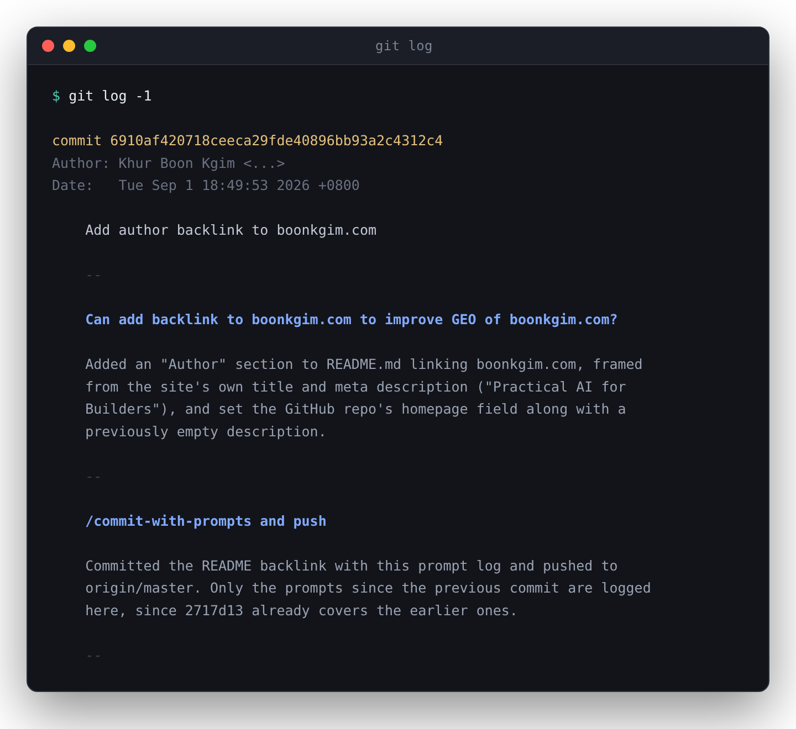

# commit-with-prompts

**Your prompt history dies in a chat window. This writes it to `git log`.**

A [Claude Code](https://claude.com/claude-code) skill that commits your work with a message
containing every prompt from the session — verbatim, in order, each followed by a one-line
summary of what it changed:

<p align="center">
  
</p>

**That is a real commit from this repo** — every commit here is written by the skill.
[Read the history](https://github.com/boonkgim/commit-with-prompts/commits/master) before
you install anything.

## Why you would want this

The session ends and the reasoning evaporates. The diff survives; the request that caused
it does not. Writing the request to `git log` puts it in the one place that is already
versioned, greppable, and travels with the code — and three things get better the longer
you do it:

- **You can find how you prompted something.** You know you got the agent to do this exact
  thing three weeks ago, and you cannot find how you asked. `git log --grep` over your own
  words beats remembering which chat it was in.
- **Your history becomes training data.** Every commit is a prompt → diff pair with a real
  outcome attached. That is what you need to sharpen a skill, a `CLAUDE.md`, or an eval
  set — and the prompts that took three corrections to land are exactly where your setup
  is weak.
- **Your repo gets a memory.** An agent picking up the project can read `git log` and learn
  what was asked for and why, in the user's own words. No separate memory store to
  maintain, no sync to go stale — it is versioned with the code and clones with it.

You get all three as a byproduct of committing normally.

## Install

```bash
git clone https://github.com/boonkgim/commit-with-prompts.git
ln -s "$PWD/commit-with-prompts" ~/.claude/skills/commit-with-prompts
```

Symlink into a project's `.claude/skills/` instead to scope it to one repo. Start a new
Claude Code session to pick it up.

## Usage

Ask for a commit however you normally would, or invoke it directly:

```
/commit-with-prompts
```

It stages what the conversation touched, writes the message, and commits. It does not push
unless you ask.

If this is useful, a ⭐ helps other people find it.

## What goes in the commit message?

Your prompts, verbatim, with three deliberate exceptions:

- **Grammar and spelling are corrected** — typos and capitalization only. Wording, order,
  and intent stay yours.
- **Sensitive values are masked** — API keys, tokens, passwords, connection strings,
  private hostnames, personal data, and flagged third-party names become bracketed
  placeholders like `[API_KEY]` or `[EMAIL]`. When in doubt, it masks.
- **Long pasted logs are summarized** — a pasted blob over ~15 lines becomes a bracketed
  summary line, so no reader mistakes the condensation for your words. Your own prose
  around it stays verbatim.

Masking is best-effort, not a secret scanner. Review the message before pushing a commit
from a session that handled credentials.

## Why not just write better commit messages?

A good commit message describes the change. This describes the *request* — a different
artifact, and the one you cannot reconstruct later. A message you write after the fact is
your summary of what you meant; the prompt is what you actually said, including the
false starts and the correction that reveals what the first attempt got wrong. That
difference is the whole value for recall, for evals, and for an agent reading back.

It also replaces `Co-Authored-By` and "generated with" trailers rather than adding to
them. The prompt log is the attribution, in more detail than a trailer can carry.

## When not to use this

- **Messages get long.** That is the point, but it fits badly with repos that enforce a
  strict format or a hard body-length lint.
- **Squash merges collapse the log.** If your repo squashes on merge, per-commit detail
  does not survive to the main branch.
- **Prompts are not always flattering.** The log is honest about how the work actually
  went. That is useful data and occasionally an awkward read.

## Author

Built by **Khur Boon Kgim** — [boonkgim.com](https://boonkgim.com), where I write about
practical AI for builders: AI agents, coding workflows, and shipping software.

## License

MIT — see [LICENSE](LICENSE).
